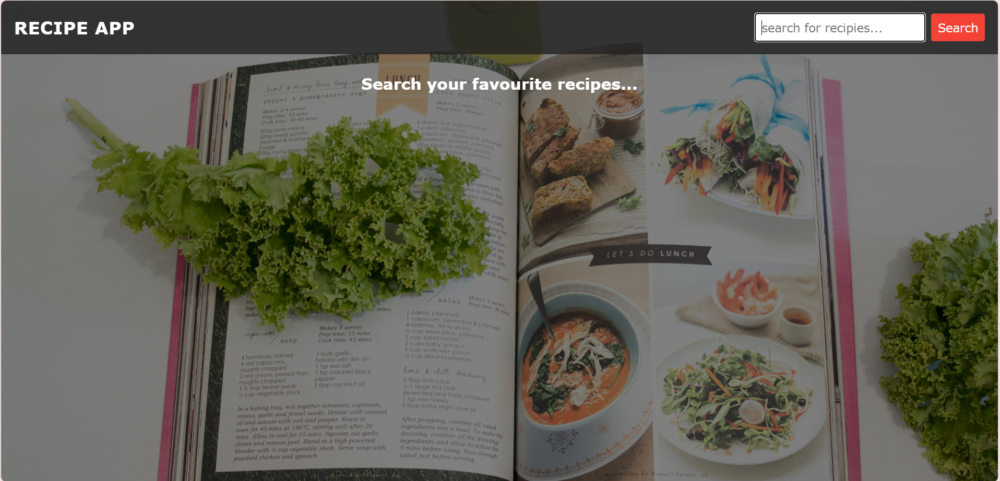
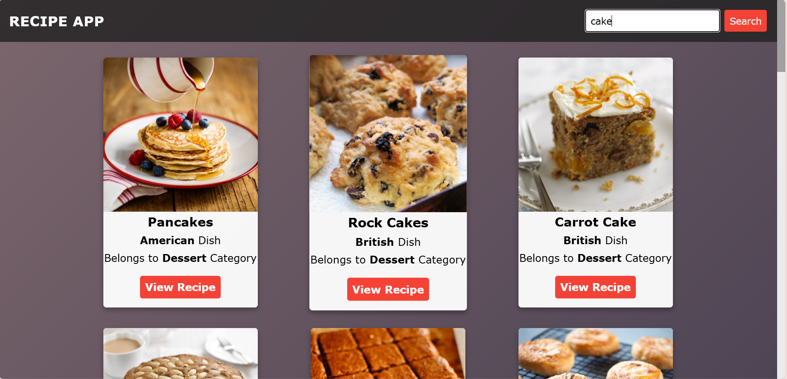
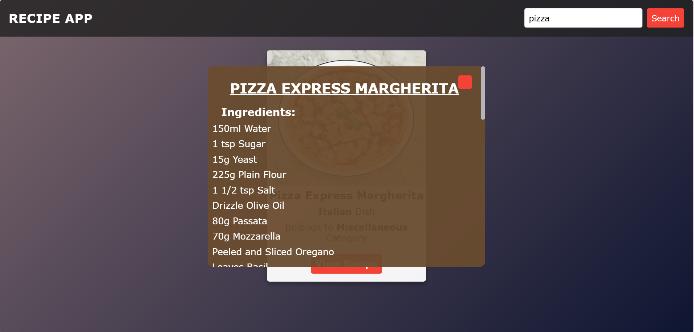

# 🍴 Recipe App

A beautifully designed and user-friendly **Recipe App** built using **HTML, CSS, and JavaScript**.  
This app helps food lovers easily explore delicious recipes with mouth-watering visuals and detailed instructions.  

---

## 🌟 Features

- 🧁 Displays multiple food recipes with images  
- 🍕 Clean and responsive design  
- 🍔 Easy navigation between different dishes  
- 🍜 Lightweight and fast-loading web app  
- 🍰 Simple UI for a smooth user experience  

---

## 🛠️ Technologies Used

- **HTML5** – For the structure  
- **CSS3** – For styling and layout  
- **JavaScript (ES6)** – For interactivity  

---

## 🚀 Live Demo

🔗 [View Live Recipe App](https://divyaalla22.github.io/Recipe-App/)

---

## 📸 Screenshots

---

## 💡 Future Enhancements

- 🔍 Add a search bar to filter recipes  
- ❤️ Add a favorites section  
- 📱 Convert into a mobile app using React or Flutter  

---

## 👩‍💻 Author

**Divya Alla**  
🌐 [Portfolio](https://divyaalla22.github.io/Portfolio-Website/)  
💼 [LinkedIn](https://www.linkedin.com/in/divya-alla/)  
📧 Email: divyaallaa@gmail.com  

---

⭐ *If you like this project, give it a star on GitHub!* ⭐

